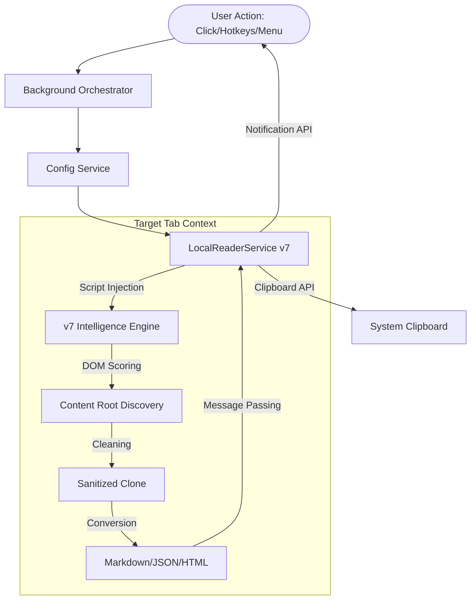
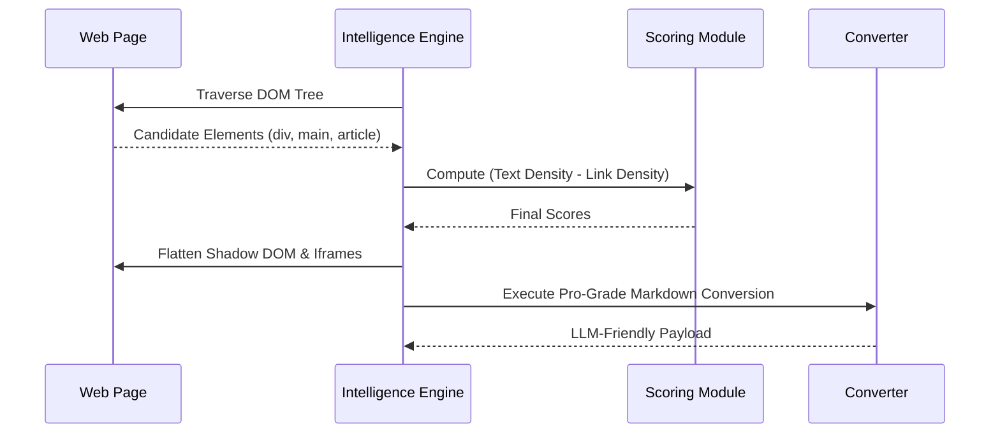

<div align="center">

# 🚀 Jina Reader — Local Edition (v7)
**Professional-Grade • Local-First • Privacy-Centric**

*Transform any webpage into high-fidelity, LLM-friendly Markdown entirely within the browser.*

[](https://opensource.org/licenses/MIT)
[](#-technical-excellence)
[](#-privacy--security)
[](https://github.com/AhmadHassan-BTed)

---
**Designed for AI Workflows. Engineered for Privacy.**
</div>

## 🌐 The Philosophy
In an era of cloud-dependency and rate-limited APIs, **Jina Reader (Local)** represents a pivot back to local-first computing. This project eliminates the middleman, removing the need for `r.jina.ai` cloud calls by implementing the entire extraction and transformation pipeline directly in the browser's runtime. Content remains local, speed is absolute, and usage is infinite.

---

## 🛠 Architectural Excellence

The system is built on a modular, Service-Oriented Architecture (SOA) designed to handle the complexities of the modern web (Shadow DOM, dynamic iframes, and SPA layouts).

### 1. High-Level System Flow
The following diagram illustrates the lifecycle of a single "Copy" request, from the user's action to the final clipboard entry.



### 2. The v7 Intelligence Engine
At the heart of the project is the **Heuristic Scoring Engine**. Instead of "guessing" where the content is, it calculates a text-to-link density ratio and penalizes interactive "noise" (dashboards, buttons, navs).



---

## 💎 Feature Matrix

| Feature | Local Engine (v7) | Cloud Reader |
| :--- | :---: | :---: |
| **Privacy** | 🔒 100% Local | ☁️ Cloud Processed |
| **Rate Limits** | ♾️ Infinite | ⚠️ Strictly Limited |
| **Cost** | 💸 $0 | 💰 Token Based |
| **Shadow DOM** | ✅ Supported | ❌ Limited |
| **Table Formatting** | ✅ Pro Grade | ✅ Basic |
| **Full Pageshots** | ✅ Stitched Canvas | ❌ N/A |

---

## 📂 Repository Structure

```text
p:/extensions/JinaClip - Copy Page for LLM/
├── scripts/
│   └── build.js          # Professional packaging pipeline
├── src/
│   ├── background/
│   │   └── index.js      # Lifecycle & Event Orchestration
│   ├── services/
│   │   └── localReader.js # Core Extraction & Transformation Engine (v7)
│   ├── utils/
│   │   └── logger.js      # System-wide observability
│   └── config/
│       ├── constants.js   # Immutable definitions
│       └── defaultSettings.js
├── icons/                # High-fidelity visual assets
└── manifest.json         # Extension Manifest (MV3)
```

---

## 🏗️ Technical Pipeline: Full Page Capture
The "Pageshot" feature utilizes a multi-stage stitching pipeline to capture full-length articles without loss of detail.

1. **Dimension Analysis:** Calculates `scrollHeight` and `viewHeight`.
2. **Synchronized Scrolling:** Executes discrete jumps with paint-settle delays.
3. **Canvas Orchestration:** Assembles visible segments in a `OffscreenCanvas`.
4. **Data Delivery:** Converts the final buffer to a high-quality Markdown-wrapped Base64 string.

---

## 🚀 Installation & Development

### Onboarding for Contributors
The codebase is written in vanilla ES6+ to ensure zero-coupling and maximum longevity.

1. **Clone & Setup:**
   ```powershell
   git clone <repo-url>
   npm install
   ```
2. **Build for Production:**
   ```powershell
   npm run build
   ```
3. **Browser Loading:**
   - Open `chrome://extensions/`
   - Load the `dist/` folder as an "Unpacked Extension."

---

## 📋 Professional Usage

- **Quick Action:** Left-click the extension icon for a standard Markdown copy.
- **Precision Extraction:** Right-click the icon to select specific formats (JSON, HTML, Text).
- **Automation:** Use the Global Shortcut `Alt+Shift+J` for immediate capture.

---

## ⚖️ Credits & License
This project was architected and developed by **Ahmad Hassan (B-Ted)** as a part of the movement toward high-performance, local-first AI tools.

Distributed under the **MIT License**. Contributions that align with the core philosophy of "Clean Code & User Privacy" are welcomed.

---
<div align="center">
<i>"The best way to read the web is locally."</i>
</div>
