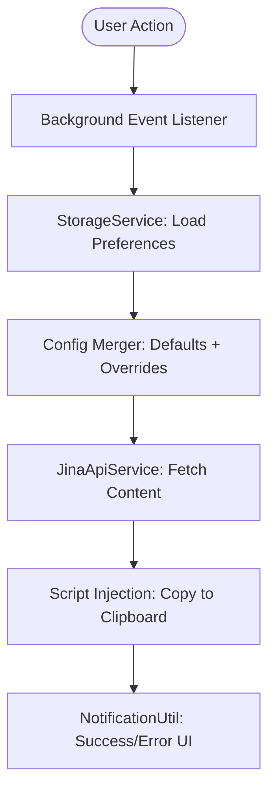

# System Architecture: JinaClip Extension

This document outlines the architectural decisions and design patterns used in the JinaClip browser extension.

## Design Philosophy

The extension is designed to be **Lean, Modular, and Extensible**. 

### 1. Service-Oriented Logic
Business logic is encapsulated in stateless services located in `src/services/`.
- `JinaApiService`: Handles the transformation of configuration objects into HTTP headers and manages the lifecycle of fetch requests to `r.jina.ai`.
- `StorageService`: Abstracts the `chrome.storage.sync` API, providing a clean interface for preference management.

### 2. Orchestration Layer
The `background/index.js` act as the application orchestrator. It listens for events (clicks, shortcuts, menus) and coordinates the flow of data between services. This ensures that UI components (like the options page) remain decoupled from core logic.

### 3. Native ES Modules
We use native browser ES modules (`type: "module"`) to avoid the complexity of a build step during development. This provides:
- **Instant Debugging:** No transpilation lag.
- **Modern Standards:** Aligning with the current state of Chrome MV3.
- **Code Splitting:** Native support for importing only what is needed.

## Data Flow

## Security Considerations

- **API Key Handling:** Keys are never logged or sent to any third-party except Jina AI.
- **Content Security Policy (CSP):** The extension strictly adheres to MV3 CSP, ensuring no unsafe eval or remote script execution.
- **Minimal Permissions:** We only request permissions absolutely necessary for the core functionality (`activeTab`, `scripting`, `storage`).
